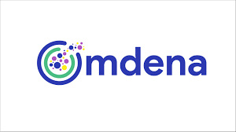

## Hi, I'm Itamar! 👋

  ### A little about me - 
👨‍🎓 BSc in Electrical Engineering from Technion - Israel Institute of Technology,  
🤖 Specializing in Machine Learning, Signal and Image Processing and Power Systems and Renewable Energy,  
🌐 AND MOST IMPORTANTLY - I'm incredibly passionate about using engineering to improve lives and make a positive impact.

📈 Currently looking for a full-time position as a COMPUTER VISION ENGINEER, where my skills and knowledge can be applied and expanded.  

  ### 🏗️ My recent activity includes: 
- Working on 3 projects toward the end of my studies:  
check them out here - 
  - 🐭 [Mice ASD diagnosis](https://github.com/etgins/Mice_ASD_Diagnosis) 
  - 🐟 [Jellyfish orientation detection](https://github.com/etgins/jellyfish_orientation) - repository currently under construction
  - 🔫 [Weapon detection with YOLOv5](https://github.com/etgins/weapon_detection_with_transfer_learning)
- Omdena ['Mastering Computer Vision to Make a positive Impact'](https://omdena.com/course/mastering-computer-vision-to-make-an-impact-real-world-case-study/) Course
- Udemy ['Python for Computer Vision with OpenCV and Deep Learning'](https://www.udemy.com/course/python-for-computer-vision-with-opencv-and-deep-learning/) Course.

  
  

### Languages and Tools:

   
   

   
   
<a href="https://www.linux.org/" target="_blank"> 
<a href="https://github.com/" target="_blank"> 
 
 
  

  ### 🤝 Always looking for a chance to collaborate and contribute to new projects, so reach out anytime!

  
  
  
  <!--
**etgins/etgins** is a ✨ _special_ ✨ repository because its `README.md` (this file) appears on your GitHub profile.

Here are some ideas to get you started:

- 🔭 I’m currently working on ...
- 🌱 I’m currently learning ...
- 👯 I’m looking to collaborate on ...
- 🤔 I’m looking for help with ...
- 💬 Ask me about ...
- 📫 How to reach me: ...
- 😄 Pronouns: ...
- ⚡ Fun fact: ...
-->
